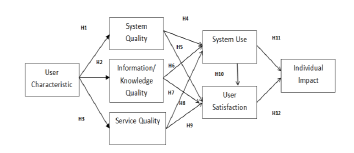
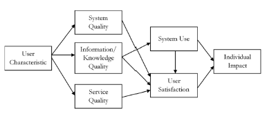
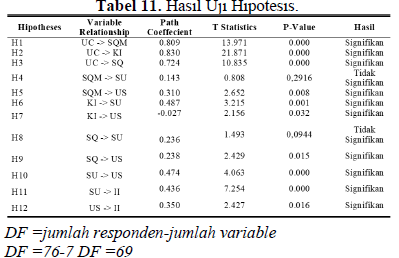

# Spotify Application Success Evaluation using DeLone and McLean Model

Repository ini berisi dokumentasi dan ringkasan penelitian
yang mengevaluasi tingkat kesuksesan aplikasi **Spotify**
berdasarkan **Model Kesuksesan Sistem Informasi DeLone dan McLean**.

Penelitian ini berfokus pada persepsi pengguna profesional
terhadap kualitas sistem, kualitas informasi, dan kualitas layanan,
serta dampaknya terhadap kepuasan pengguna
dan manfaat bersih (*net benefits*).

---

## Research Background

Aplikasi streaming musik seperti Spotify
memiliki peran penting dalam mendukung produktivitas
dan aktivitas profesional sehari-hari,
baik sebagai media hiburan maupun pendukung fokus kerja.

Untuk mengevaluasi tingkat keberhasilan
implementasi sistem informasi tersebut,
digunakan **Model Kesuksesan Sistem Informasi DeLone dan McLean**
yang telah banyak diterapkan
dalam penelitian evaluasi sistem informasi.

---

## Research Objectives

Tujuan dari penelitian ini adalah:
- Mengevaluasi tingkat kesuksesan aplikasi Spotify
- Menganalisis pengaruh kualitas sistem, kualitas informasi,
  dan kualitas layanan terhadap penggunaan dan kepuasan pengguna
- Mengukur dampak penggunaan aplikasi terhadap manfaat bersih (*net benefits*)
- Menerapkan Model DeLone dan McLean
  sebagai kerangka evaluasi kesuksesan sistem informasi

---

## Research Model

Model penelitian yang digunakan merupakan
**pengembangan dari Model Kesuksesan Sistem Informasi DeLone dan McLean**,
dengan konstruk dan indikator
yang diadaptasi dari penelitian
**Assegaff, Setiawan, et al. (2017)**.

Model ini digunakan untuk menganalisis
hubungan antar variabel
dalam menentukan tingkat kesuksesan aplikasi Spotify.

<p align="center">
  
</p>

### Variabel Penelitian
- **System Quality**
- **Information Quality**
- **Service Quality**
- **Use / Intention to Use**
- **User Satisfaction**
- **Net Benefits**

---

## Research Methodology

Metodologi penelitian yang digunakan meliputi tahapan berikut:
1. Penentuan variabel penelitian
   berdasarkan Model DeLone dan McLean
2. Penyusunan instrumen kuesioner
3. Pengumpulan data dari responden profesional
4. Analisis data secara kuantitatif
5. Interpretasi hasil dan penarikan kesimpulan

---

## Research Output

<p align="center">
  
</p>

<p align="center">
  
</p>

Output utama dari penelitian ini meliputi:
- Analisis tingkat kesuksesan aplikasi Spotify
- Hubungan antar variabel dalam Model DeLone dan McLean
- Identifikasi faktor-faktor yang memengaruhi kepuasan pengguna
- Rekomendasi pengembangan sistem
  berdasarkan hasil evaluasi empiris

---

## Repository Structure

```text
spotify-app-success-delone-mclean/
├── README.md
├── docs/
│   ├── research-summary.md
│   └── methodology.md
├── assets/
│   ├── methodology.png
│   ├── delone-mclean-result.png
│   └── hasil-hipotesis.png
└── results/
    └── findings-summary.md
```

Full research paper is available at:
https://www.researchgate.net/publication/387747502_Melodi_Produktivitas_Evaluasi_Kesuksesan_Aplikasi_Spotify_pada_Kalangan_Profesional_Kota_Jambi_Berdasarkan_Model_Delone_dan_McLean
